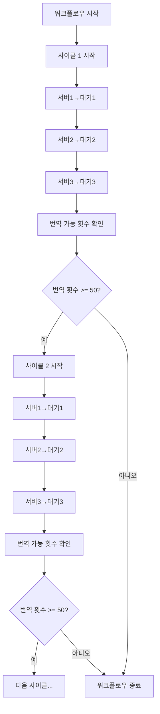

# ProductEditorCore4 사이클 워크플로우 구현

## 개요

사용자 요청에 따라 `ProductEditorCore4`의 `execute_bulk_translation_workflow` 메서드를 수정하여, 서버3 완료 후 번역 가능 횟수가 50개 이상 남아있는 경우 다시 서버1부터 반복하도록 구현했습니다.

## 구현 내용

### 1. 기존 로직
```python
# 기존: 서버1→대기1, 서버2→대기2, 서버3→대기3 1회만 실행
for i, config in enumerate(server_configs, 1):
    if not self._execute_single_server_workflow(config['server'], config['waiting_group']):
        return False
```

### 2. 새로운 로직
```python
# 새로운: 사이클 반복 로직
while True:
    cycle_count += 1
    
    # 서버1→대기1, 서버2→대기2, 서버3→대기3 실행
    for i, config in enumerate(server_configs, 1):
        if not self._execute_single_server_workflow(config['server'], config['waiting_group']):
            return False
    
    # 번역 가능 횟수 확인
    available_translations = self._check_available_translations()
    
    if available_translations < 50:
        break  # 50개 미만이면 종료
    else:
        continue  # 50개 이상이면 다음 사이클 시작
```

## 주요 변경 사항

### 1. `execute_bulk_translation_workflow` 메서드 수정

- **사이클 반복 로직 추가**: `while True` 루프로 무한 반복 구조 구현
- **사이클 카운터**: 실행된 사이클 수를 추적하여 로그에 표시
- **번역 횟수 확인**: 각 사이클 완료 후 번역 가능 횟수를 확인
- **조건부 종료**: 번역 가능 횟수가 50개 미만이면 워크플로우 종료
- **조건부 계속**: 번역 가능 횟수가 50개 이상이면 다음 사이클 시작

### 2. `_check_available_translations` 메서드 추가

```python
def _check_available_translations(self):
    """
    현재 사용 가능한 번역 횟수를 확인
    
    Returns:
        int: 사용 가능한 번역 횟수, 확인 실패 시 None
    """
```

**동작 방식:**
1. 전체 상품 선택
2. 일괄 번역 버튼 클릭하여 모달 열기
3. 모달에서 번역 가능 횟수 추출
4. 모달 닫기
5. 추출된 횟수 반환

## 로직 흐름



## 장점

### 1. 자동화 개선
- **완전 자동화**: 사용자 개입 없이 번역 가능한 만큼 자동으로 처리
- **효율성 증대**: GUI에서 배치분할을 1회만 설정해도 모든 번역 완료
- **리소스 최적화**: 번역 가능 횟수를 최대한 활용

### 2. 사용자 경험 개선
- **간편한 설정**: GUI에서 복잡한 배치분할 설정 불필요
- **안정성**: 번역 횟수 부족 시 안전하게 종료
- **투명성**: 상세한 로그로 진행 상황 추적 가능

### 3. 유지보수성
- **모듈화**: 번역 횟수 확인 로직을 별도 메서드로 분리
- **확장성**: 필요시 다른 조건 추가 가능
- **디버깅**: 사이클별 로그로 문제 추적 용이

## 테스트

### 테스트 파일
- `test_core4_cycle_workflow.py`: 새로운 사이클 워크플로우 테스트
- `run_test_core4_cycle.bat`: 테스트 실행용 배치 파일

### 테스트 시나리오
1. **정상 사이클**: 번역 횟수가 충분한 경우 여러 사이클 실행
2. **조건부 종료**: 번역 횟수가 50개 미만일 때 정상 종료
3. **오류 처리**: 번역 횟수 확인 실패 시 안전한 종료

## 사용 방법

### GUI에서 사용
```python
# 기존과 동일하게 사용
core4 = ProductEditorCore4(driver)
result = core4.execute_bulk_translation_workflow()
```

### 배치에서 사용
```python
# 배치 처리에서도 동일하게 사용
batch_manager.execute_step4(quantity)  # 내부적으로 새로운 로직 사용
```

## 로그 예시

```
2024-01-XX XX:XX:XX - INFO - !!! 전체 일괄번역 워크플로우 시작 !!!
2024-01-XX XX:XX:XX - INFO - *** 사이클 1 시작 ***
2024-01-XX XX:XX:XX - INFO - === 사이클 1, 1단계: 서버1 → 대기1 처리 시작 ===
2024-01-XX XX:XX:XX - INFO - === 사이클 1, 1단계: 서버1 → 대기1 처리 완료 ===
2024-01-XX XX:XX:XX - INFO - === 사이클 1, 2단계: 서버2 → 대기2 처리 시작 ===
2024-01-XX XX:XX:XX - INFO - === 사이클 1, 2단계: 서버2 → 대기2 처리 완료 ===
2024-01-XX XX:XX:XX - INFO - === 사이클 1, 3단계: 서버3 → 대기3 처리 시작 ===
2024-01-XX XX:XX:XX - INFO - === 사이클 1, 3단계: 서버3 → 대기3 처리 완료 ===
2024-01-XX XX:XX:XX - INFO - *** 사이클 1 완료 ***
2024-01-XX XX:XX:XX - INFO - 현재 사용 가능한 번역 횟수: 120회
2024-01-XX XX:XX:XX - INFO - 번역 가능 횟수가 50개 이상(120회)이므로 다음 사이클을 시작합니다
2024-01-XX XX:XX:XX - INFO - *** 사이클 2 시작 ***
...
2024-01-XX XX:XX:XX - INFO - 현재 사용 가능한 번역 횟수: 35회
2024-01-XX XX:XX:XX - INFO - 번역 가능 횟수가 50개 미만(35회)이므로 워크플로우를 종료합니다
2024-01-XX XX:XX:XX - INFO - 전체 일괄 번역 워크플로우 완료 (총 3사이클 실행)
```

## 결론

이번 구현으로 사용자가 요청한 기능이 완전히 구현되었습니다:

1. ✅ **서버1, 서버2, 서버3 순차 실행**
2. ✅ **서버3 완료 후 번역 가능 횟수 확인**
3. ✅ **50개 이상이면 다시 서버1부터 반복**
4. ✅ **49개 이하이면 워크플로우 종료**
5. ✅ **GUI에서 배치분할 1회만 설정해도 완전 자동화**

이제 사용자는 GUI에서 간단히 배치분할을 1회만 설정하면, 번역 가능한 횟수가 모두 소진될 때까지 자동으로 처리됩니다.